<!-- ===================== HERO ===================== -->

  

  

  
  
  

---

## ⚡ About
- **Rust / Kotlin** engineer (performance-minded, engineering-focused)
- Interests: **emulation**, **game backend**, **distributed systems**
- Main project: **Nesium** — **Rust core + Flutter UI**

---

## 🚀 Featured Project: Nesium

  
  
  
  
  
  

> A NES emulator project with a **Rust** core and a **Flutter** UI.

---

## 🧰 Tech Stack

  

---

## 📌 Highlights
- **Emulation & Tooling**: correctness, performance, developer experience
- **Backend & Systems**: scalable services, reliability, practical engineering

---

## 📈 Metrics

