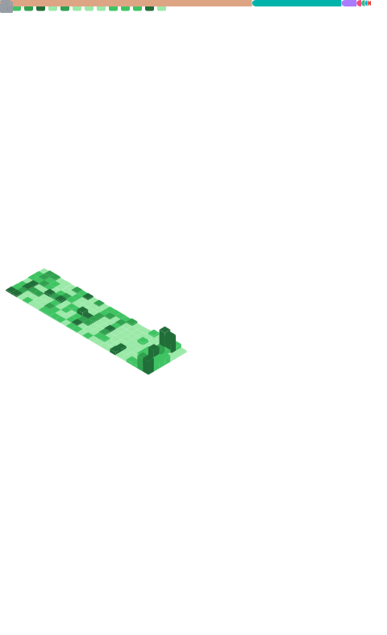

<!-- ===================== HERO ===================== -->

  

  

  
  
  

---

## About
- **Rust / Kotlin** developer focused on **performance**, **reliability**, and clean tooling
- Building **Nesium**, a **NES emulator** with a **Rust core** and **Flutter UI**
- Interested in **emulation**, **backend systems**, **developer experience**, and polished engineering
- Also into **Hi-Fi audio**, **ACG culture**, and products that feel sharp at both UX and low-level detail

---

## Featured: Nesium

  
  
  
  
  
  

> A NES emulator project with a **Rust** core and a **Flutter** UI.

---

## Tech Stack

  

---

## Metrics

